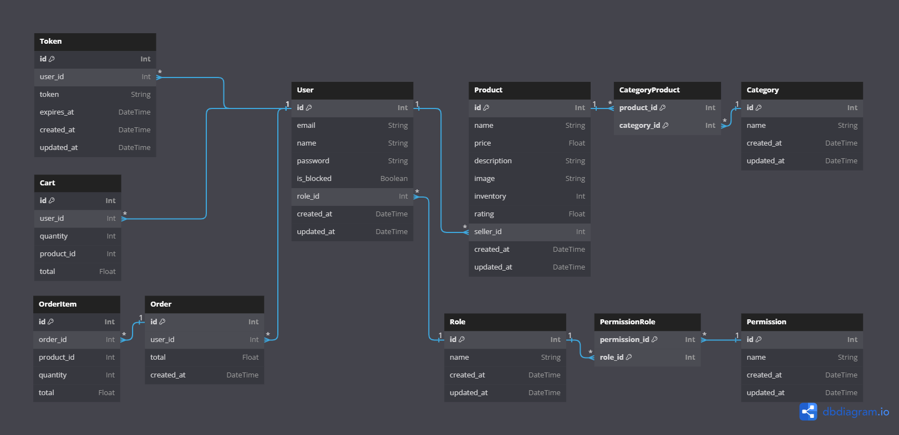

# E-COMMERCE API DOCUMENTATION

This is a RESTful API for an e-commerce platform.

# CONTENTS:

- ARCHITECTURES
  - MODEL BUSINESS
    - ROLE
    - PERMISSIONS
    - ERD DESIGN
- ENDPOINTS
  - PRODUK
    1. ADD NEW PRODUCT
    2. SHOW ALL PRODUCTS
    3. SHOW A PRODUCT
    4. UPDATE A PRODUCT DATA BY ID
    5. DELETE A PRODUCT BY ID
  - CART
    1. ADD OR SUBTRACT PRODUCT IN CART
    2. SHOW CART ITEMS
    3. DELETE A CART ITEM BY ID
    4. DELETE ALL CART ITEMS
  - ORDER AND PAYMENT
    1. CHECKOUT CART ITEMS
    2. SHOW ALL ORDERS
    3. PAYMENT
  - AKUN
    1. REGISTER NEW USER
    2. LOGIN TO ACCOUNT
  - PROFILE
    1. SHOW PROFILE USER
    2. EDIT PROFILE
    3. EDIT PASSWORD
  - CATEGORY
    1. SHOW ALL CATEGORIES
    2. ADD NEW CATEGORY
    3. EDIT CATEGORY
    4. DELETE CATEGORY
    5. SHOW ALL PRODUCT BY CATEGORY
  - SEARCH
    1. SEARCH PRODUCT BASE ON NAME, DESCRIPTION, OR CATEGORY

# A. ARCHITECTURES

## MODEL BUSINESS

### ROLE

Ada 3 role atau peran di dalam API ini, yakni: Seller, Regular User, dan Administrator.

1. Seller (`seller`)

   Seller adalah user yang menjual product-product. Walaupun demikian, Seller masih dapat belanja product-product tetapi seller tidak dapat belanja product yang dia jual.

2. Regular User (`regular_user`)

   Regular User adalah user yang membeli product-product. Regular User tidak dapat menjual product. Namun, Regular User dapat membuka akses untuk menjadi seller.

3. Administrator (`administrator`)

   Administrator adalah user yang dapat melakukan apapun, termasuk menjual dan membeli. Hal yang membedakan Administrator dengan seller adalah Administrator dapat mengedit, menambahkan, dan menghapus kategori.

### PERMISSIONS

Berdasarkan penjabaran role sebelumnya, maka permissions atau hal-hal yang dapat dilakukan **Seller** sebagai berikut:

```jsx
Permission.BROWSE_PRODUCTS,   // Melihat semua product
Permission.READ_PRODUCT,      // Melihat 1 product
Permission.EDIT_PRODUCT,      // Meng-update 1 product yang sudah ada.
Permission.ADD_PRODUCT,       // Menambahkan product
Permission.DELETE_PRODUCT,    // Menghapus product

Permission.BROWSE_CARTS,      // Melihat semua isi cart
Permission.ADD_CART,          // Menambah atau Mengurangi product di cart
Permission.DELETE_CART,       // Menghapus cart

Permission.BROWSE_CATEGORIES, // Melihat semua category
Permission.READ_CATEGORY,     // Melihat 1 category

Permission.ADD_ORDER,         // Membuat order / checkout

Permission.ADD_PAYMENT,       // Melakukan Pembayaran
```

Hal-hal yang dapat dilakukan **Regular User** sebagai berikut:

```jsx
Permission.BROWSE_PRODUCTS,   // Melihat semua product
Permission.READ_PRODUCT,      // Melihat 1 product

Permission.BROWSE_CARTS,      // Melihat semua isi cart
Permission.ADD_CART,          // Menambah atau Mengurangi product di cart
Permission.DELETE_CART,       // Menghapus cart

Permission.BROWSE_CATEGORIES, // Melihat semua category
Permission.READ_CATEGORY,     // Melihat 1 category

Permission.ADD_ORDER,         // Membuat order / checkout

Permission.ADD_PAYMENT,       // Melakukan Pembayaran
```

Hal-hal yang dapat dilakukan **Administrator** sebagai berikut:

```jsx
Permission.BROWSE_PRODUCTS,   // Melihat semua product
Permission.READ_PRODUCT,      // Melihat 1 product
Permission.EDIT_PRODUCT,      // Meng-update 1 product yang sudah ada.
Permission.ADD_PRODUCT,       // Menambahkan product
Permission.DELETE_PRODUCT,    // Menghapus product

Permission.BROWSE_CARTS,      // Melihat semua isi cart
Permission.ADD_CART,          // Menambah atau Mengurangi product di cart
Permission.DELETE_CART,       // Menghapus cart

Permission.BROWSE_CATEGORIES, // Melihat semua category
Permission.READ_CATEGORY,     // Melihat 1 category
Permission.EDIT_CATEGORY,     // Mengedit category
Permission.ADD_CATEGORY,      // Menambahkan category baru
Permission.DELETE_CATEGORY,   // Mengahapus category

Permission.ADD_ORDER,         // Membuat order / checkout

Permission.ADD_PAYMENT,       // Melakukan Pembayaran
```

### ERD DESIGN



- Product dapat memiliki banyak categori (M:M) ⇒ Dibuat pivot tabel CategoryProduct.
- Role dapat memiliki banyak permission(M:M) ⇒ Dibuat pivot tabel PermissionRole.

---

# B. **ENDPOINTS**

## PRODUK

### **1. ADD NEW PRODUCT**

1. Method: `POST`
2. Endpoint: `/api/products`
3. Request Header: `Authorization: Token`

   ```json
   "Authorization": "Ny1PcwlB0IUpWhqIA3nxT9WHADYG7kwK4YdLl0N4mK129fAxjg8qHjB9Yvakz8tCiOokozWxmX6Wf+IawigeDw=="
   ```

   The request header `Authorization: Token` is used to authenticate and authorize an API request. The `Token` value typically represents a token or key that is generated when a user logs in.

   `Authorization: Token` header is used to validate the user's identity and permissions when making requests to protected endpoints. It ensures that only authenticated users with valid tokens are allowed to access certain resources or perform specific actions within the system.

4. Request Body:

   ```json
   {
     "name": "Samsung HP",
     "price": 100,
     "description": "Just a HP",
     "image": "samsung.png",
     "category_id": [2], // Category bisa banyak tergantung id di Category tabel => [1,2]
     "inventory": 3,
     "rating": 4.3
   }
   ```

5. Response:

   - Product berhasil dibuat: **`201 Created` .**

   ```json
   {
     "message": "Product has been created",
     "product": {
       "id": 47,
       "name": "Samsung HP",
       "price": 100,
       "description": "Just a HP",
       "image": "samsung.png",
       "inventory": 3,
       "rating": 4.3,
       "seller_id": 10,
       "created_at": "2024-02-12T08:20:03.842Z",
       "updated_at": "2024-02-12T08:20:03.842Z"
     }
   }
   ```

   - Jika di request body `name`, `price`, `description`, `image`, `category_id` atau `inventory` tidak ada: **`400 Bad Request` .**

   ```json
   {
     "message": "All fields are required"
   }
   ```

   - Jika token tidak ada: **`401 Unauthorized`**

   ```json
   {
     "message": "Token is required"
   }
   ```

   - Jika token invalid: **`401 Unauthorized`**

   ```json
   {
     "message": "Invalid token"
   }
   ```

   - Jika token expired: **`401 Unauthorized`**

   ```json
   {
     "message": "Token is expired"
   }
   ```

   - Jika user diblock: **`401 Unauthorized`**

   ```json
   {
     "message": "Blocked user"
   }
   ```

   - Jika user belum terdaftar atau sudah terdaftar tapi tidak login: **`401 Unauthorized`**

   ```json
   {
     "message": "Unauthorized"
   }
   ```

   - Jika user tidak memiliki izin bertindak di endpoint ini: **`403 Forbidden`**

   ```json
   {
     "message": "Forbidden"
   }
   ```

   - Error lainnya: **`500 Internal Server Error` .**

   ```json
   {
     "message": "Something broke!"
   }
   ```

### 2. SHOW ALL PRODUCTS

1. Method: `GET`
2. Endpoint: `/api/products`
3. Response:

   - Jika berhasil: **`200 OK`**

   ```json
   [
     {
       "id": 40,
       "name": "Televisccscion",
       "price": 270,
       "description": "Just a tv",
       "image": "samsung.png",
       "inventory": 3,
       "rating": 4.3,
       "seller_id": 10,
       "created_at": "2024-02-11T15:05:59.831Z",
       "updated_at": "2024-02-11T15:05:59.831Z",
       "category": ["Electronics"]
     },
     {
       "id": 41,
       "name": "Samsung HP",
       "price": 100,
       "description": "Just a tv",
       "image": "samsung.png",
       "inventory": 3,
       "rating": 4.3,
       "seller_id": 10,
       "created_at": "2024-02-11T15:06:26.453Z",
       "updated_at": "2024-02-11T15:06:26.453Z",
       "category": ["Electronics", "Gadgets"]
     }
   ]
   ```

### 3. SHOW A PRODUCT

1. Method: `GET`
2. Endpoint: `/api/products/:id`
3. Response:

   - Jika berhasil: **`200 OK`**

   ```json
   {
     "id": 78,
     "name": "Samsung",
     "price": 150,
     "description": "Just a HP",
     "image": "samsung.png",
     "inventory": 2,
     "rating": 4.3,
     "seller_id": 35,
     "created_at": "2024-02-18T10:48:16.225Z",
     "updated_at": "2024-02-18T10:48:16.225Z",
     "category": ["Electronics", "Gadgets"]
   }
   ```

   - Jika param id-nya bukan angka: **`400 Bad Request`**

   ```json
   {
     "message": "id must be a number"
   }
   ```

   - Jika product tidak ditemukan: **`404 Not Found`**

   ```json
   {
     "message": "Product not found"
   }
   ```

### 4. UPDATE A PRODUCT DATA BY ID

1. Method: `PUT`
2. Endpoint: `/api/products/:id`
3. Request Body:

   ```json
   {
     "name": "Samsung S98990",
     "price": 250,
     "description": "Justa phone",
     "image": "samsung-s10.png",
     "category_id": 1,
     "inventory": 4
   }
   ```

4. Request Header: `Authorization: Token`
5. Response:

   - Jika berhasil di-update: **`200 OK`**

   ```json
   {
     "message": "product has been updated",
     "product": {
       "id": 60,
       "name": "Samsung S98990",
       "price": 250,
       "description": "Justa phone",
       "image": "samsung-s10.png",
       "inventory": 4,
       "rating": 4.3,
       "seller_id": 2,
       "created_at": "2024-02-16T06:22:02.113Z",
       "updated_at": "2024-02-17T14:39:20.097Z"
     }
   }
   ```

   - Jika orang yang meng-update product bukan seller productnya: **`401 Unauthorized`**

   ```json
   {
     "message": "You are not authorized"
   }
   ```

   - Jika di request body `name`, `price`, `description`, `image`, `category_id` atau `inventory` tidak ada: **`400 Bad Request` .** Jika token tidak ada, token invalid, token expired, blocked user, user belum terdaftar atau sudah terdaftar tapi tidak login: **`401 Unauthorized` .** Jika user tidak memiliki izin bertindak di endpoint ini: **`403 Forbidden` .**
     **_(Lihat di bagian ADD NEW PRODUCT ENDPOINT!)_**
   - Jika param id-nya bukan angka: **`400 Bad Request` .** Jika product tidak ditemukan: **`404 Not Found` .**
     **_(Lihat di bagian SHOW A PRODUCT ENDPOINT!)_**

### 5. DELETE A PRODUCT BY ID

1. Method: `DELETE`
2. Endpoint: `/api/products/:id`
3. Request Header: `Authorization: Token`
4. Response:

   - Jika product berhasil di-delete: **`200 OK`**

   ```json
   {
     "message": "Product has been deleted",
     "product": {
       "id": 74,
       "name": "TV KEREN",
       "price": 150,
       "description": "Just a HP",
       "image": "samsung.png",
       "inventory": 2,
       "rating": 4.3,
       "seller_id": 2,
       "created_at": "2024-02-17T15:30:19.386Z",
       "updated_at": "2024-02-17T15:30:19.386Z"
     }
   }
   ```

   - Jika orang yang men-delete product bukan seller productnya: **`401 Unauthorized` .**

   ```json
   {
     "message": "You are not authorized"
   }
   ```

   - Jika token tidak ada, token invalid, token expired, blocked user, user belum terdaftar atau sudah terdaftar tapi tidak login: **`401 Unauthorized` .** Jika user tidak memiliki izin bertindak di endpoint ini: **`403 Forbidden` .**
     **_(Lihat di bagian ADD NEW PRODUCT ENDPOINT!)_**
   - Jika param id-nya bukan angka: **`400 Bad Request` .** Jika product tidak ditemukan: **`404 Not Found` .**
     **_(Lihat di bagian SHOW A PRODUCT ENDPOINT!)_**

## CART

### 6. ADD OR SUBTRACT PRODUCT IN CART

1. Method: `POST`
2. Endpoint: `/api/cart`
3. Request Body:

   ```json
   {
     "product_id": 64,
     "quantity": 2 // can negatif (means subtract quantity)
   }
   ```

   _Kalau quantity positif (+) : menambah quantity ke cart sebanyak valuenya. Kalau quantity negatif (-) : mengurangi quantity sebanyak valuenya._

4. Request Header: `Authorization: Token`
5. Response:

   - Jika berhasil masuk ke cart: **`200 OK`**

   ```json
   {
     "message": "Product added to cart",
     "cartItem": {
       "id": 91,
       "user_id": 1,
       "quantity": 1,
       "product_id": 64,
       "total": 150
     }
   }
   ```

   - Jika berhasil di kurangi dari cart: **`200 OK`**

   ```json
   {
     "message": "Product reduced to cart",
     "cartItem": {
       "id": 99,
       "user_id": 4,
       "quantity": 1,
       "product_id": 73,
       "total": 150
     }
   }
   ```

   - Jika ketika dikurangi, quantity menjadi 0: **`200 OK`**

   ```json
   {
     "message": "Product removed from cart"
   }
   ```

   - Jika input quantity melebihi inventory product: `400 Bad Request`

   ```json
   {
     "message": "Only {inventory} items left in stock"
   }
   ```

   - Jika mengurangi product yang tidak ada di cart: **`400 Bad Request`**

   ```json
   {
     "message": "The reduced product is not in the cart"
   }
   ```

   - Jika input reques body bukan angka atau 0: `400 Bad Request`

   ```json
   {
     "message": "Must be a valid product_id and quantity"
   }
   ```

   - Jika Seller membeli productnya sendiri: **`403 Forbidden`**

   ```json
   {
     "message": "Seller can not buy his product"
   }
   ```

   - Jika product tidak ada: **`404 Not Found`**

   ```json
   {
     "message": "Product not found"
   }
   ```

   - Jika token tidak ada, token invalid, token expired, blocked user, user belum terdaftar atau sudah terdaftar tapi tidak login: **`401 Unauthorized` .** Jika user tidak memiliki izin bertindak di endpoint ini: **`403 Forbidden` .**
     **_(Lihat di bagian ADD NEW PRODUCT ENDPOINT!)_**

### 7. SHOW CART ITEMS

1. Method: `GET`
2. Endpoint: `/api/cart`
3. Request Header: `Authorization: Token`
4. Response:

   - Jika di dalam cart ada isinya: **`200 OK`**

   ```json
   {
     "total": 600,
     "cart": [
       {
         "id": 104,
         "user_id": 4,
         "quantity": 2,
         "product_id": 73,
         "total": 300
       },
       {
         "id": 105,
         "user_id": 4,
         "quantity": 2,
         "product_id": 72,
         "total": 300
       }
     ]
   }
   ```

   - Jika cart kosong: **`404 Not Found`**

   ```json
   {
     "message": "Cart is empty"
   }
   ```

   - Jika token tidak ada, token invalid, token expired, blocked user, user belum terdaftar atau sudah terdaftar tapi tidak login: **`401 Unauthorized` .** Jika user tidak memiliki izin bertindak di endpoint ini: **`403 Forbidden` .**
     **_(Lihat di bagian ADD NEW PRODUCT ENDPOINT!)_**

### 8. DELETE A CART ITEM BY ID

1. Method: `DELETE`
2. Endpoint: `/api/cart/:cartId`
3. Request Header: `Authorization: Token`
4. Response:

   - Jika berhasil menghapus produck dari cart: **`200 OK`**

   ```json
   {
     "message": "Product removed from cart"
   }
   ```

   - Jika Product tidak ditemukan: **`404 Not Found`**

   ```json
   {
     "message": "Product not found in cart"
   }
   ```

   - Jika token tidak ada, token invalid, token expired, blocked user, user belum terdaftar atau sudah terdaftar tapi tidak login: **`401 Unauthorized` .** Jika user tidak memiliki izin bertindak di endpoint ini: **`403 Forbidden` .**
     **_(Lihat di bagian ADD NEW PRODUCT ENDPOINT!)_**

### 9. DELETE ALL CART ITEMS

1. Method: `DELETE`
2. Endpoint: `/api/cart`
3. Request Header: `Authorization: Token`
4. Response:

   - Jika berhasil menghapus keseluruhan cart: **`200 OK`**

   ```json
   {
     "message": "Cart emptied"
   }
   ```

   - Jika token tidak ada, token invalid, token expired, blocked user, user belum terdaftar atau sudah terdaftar tapi tidak login: **`401 Unauthorized` .** Jika user tidak memiliki izin bertindak di endpoint ini: **`403 Forbidden` .**
     **_(Lihat di bagian ADD NEW PRODUCT ENDPOINT!)_**

## ORDER AND PAYMENT

### 10. CHECKOUT CART ITEMS

1. Method: `POST`
2. Endpoint: `/api/order`
3. Request Header: `Authorization: Token`
4. Request Body:

   ```json
   {
     "cart_id": [{cart_id_1}, {cart_id_2}] //cart id yg dipilih bisa banyak
   }
   ```

5. Response:

   - Jika checkout berhasil: **`200 OK`**

   ```json
   {
     "message": "Order placed successfully",
     "order": {
       "id": 26,
       "user_id": 4,
       "total": 150,
       "status": "Unpaid",
       "created_at": "2024-02-17T17:48:31.740Z"
     }
   }
   ```

   - Jika tidak ada cart id yang dicheck out: `400 Bad Request`

   ```json
   {
     "message": "Cart is empty"
   }
   ```

   - Jika token tidak ada, token invalid, token expired, blocked user, user belum terdaftar atau sudah terdaftar tapi tidak login: **`401 Unauthorized` .** Jika user tidak memiliki izin bertindak di endpoint ini: **`403 Forbidden` .**
     **_(Lihat di bagian ADD NEW PRODUCT ENDPOINT!)_**

### 11. SHOW ALL ORDERS

1. Method: `GET`
2. Endpoint: `/api/order`
3. Request Header: `Authorization: Token`
4. Response:

   - Jika berhasil: **`200 OK`**

   ```json
   {
     "orders": [
       {
         "id": 26,
         "user_id": 4,
         "total": 150,
         "status": "Unpaid",
         "created_at": "2024-02-17T17:48:31.740Z",
         "items": [
           {
             "id": 31,
             "order_id": 26,
             "product_id": 70,
             "quantity": 1,
             "total": 150
           }
         ]
       },
       {
         "id": 27,
         "user_id": 4,
         "total": 600,
         "status": "Unpaid",
         "created_at": "2024-02-17T18:00:49.462Z",
         "items": [
           {
             "id": 32,
             "order_id": 27,
             "product_id": 73,
             "quantity": 2,
             "total": 300
           },
           {
             "id": 33,
             "order_id": 27,
             "product_id": 71,
             "quantity": 1,
             "total": 150
           },
           {
             "id": 34,
             "order_id": 27,
             "product_id": 72,
             "quantity": 1,
             "total": 150
           }
         ]
       }
     ]
   }
   ```

   - Jika user memang tidak pernah memiliki history order: **`404 Not Found`**

   ```json
   {
     "message": "No order found"
   }
   ```

   - Jika token tidak ada, token invalid, token expired, blocked user, user belum terdaftar atau sudah terdaftar tapi tidak login: **`401 Unauthorized` .** Jika user tidak memiliki izin bertindak di endpoint ini: **`403 Forbidden` .**
     **_(Lihat di bagian ADD NEW PRODUCT ENDPOINT!)_**

### 12. PAYMENT

1. Method: `POST`
2. Endpoint: `/api/payment`
3. Request Body:

   ```json
   {
     "order_id": 7
   }
   ```

4. Request Header: `Authorization: Token`
5. Response:

   - Jika payment berhasil: **`200 OK`**

   ```json
   {
     "message": "Payment processed successfully"
   }
   ```

   - Jika payment gagal: **`400 Bad Request`**

   ```json
   {
     "message": "Payment failed"
   }
   ```

## AKUN

### 13. REGISTER NEW USER

1. Method: `POST`
2. Endpoint: `/api/signup`
3. Request Body:

   ```json
   {
     "name": "My Name",
     "email": "Myemail@gmail.com",
     "password": "12345678"
   }
   ```

4. Response:

   - Jika berhasil register: **`201 Created`**

   ```json
   {
     "message": "User has been created",
     "data": {
       "id": 31,
       "email": "Myemail@gmail.com",
       "name": "My Name",
       "role": "regular_user"
     }
   }
   ```

   - Jika error selama mendaftar: **`422 Unprocessable Entity`**

   ```json
   {
     "errors": {
       "name": "Name is required",
       "email": "Must be a valid email",
       "password": "Password must be at least 8 characters"
     }
   }
   ```

   Error-error name: `"Name is required"` .

   Error-error email: `"Email is required”`, `"Must be a valid email”`, dan `"Email already in use”` .

   Error-error password: `"Password is required”` dan `"Password must be at least 8 characters”` .

### 14. LOGIN TO ACCOUNT

1. Method: `POST`
2. Endpoint: `/api/login`
3. Request Body:

   ```json
   {
     "email": "myemail@gmail.com",
     "password": "12345678"
   }
   ```

4. Response:

   - Jika berhasil: **`200 OK`**

   ```json
   {
     "token": "iTSIGVojyAeW6KEsETW9aUkg7Msnj/BusJt3F6j4s0T5qMZavuUYtWYzZ20nNFLdVPrlmnFmKoNPQPvVaNIQZA==",
     "user": {
       "id": 31,
       "email": "Myemail@gmail.com",
       "name": "My Name"
     }
   }
   ```

   - Jika error selama login: **`422 Unprocessable Entity`**

   ```json
   {
     "errors": {
       "email": "Email is required",
       "password": "Password is required"
     }
   }
   ```

   Error-error email: `"Email is required”`, `"Must be a valid email”`, `"User is blocked”`, dan `"Email is not registered”` .

   Error-error password: `"Password is required”` dan `"Invalid password”` .

## PROFILE

### 15. SHOW PROFILE USER

1. Method: `GET`
2. Endpoint: `/api/profile`
3. Request Header: `Authorization: Token`
4. Response:

   - Jika berhasil: **`200 OK`**

   ```json
   {
     "id": 31,
     "email": "Myemail@gmail.com",
     "name": "My Name",
     "is_blocked": false,
     "role_id": 3,
     "image": null
   }
   ```

   - Jika token tidak ada, token invalid, token expired, blocked user, user belum terdaftar atau sudah terdaftar tapi tidak login: **`401 Unauthorized` .** Jika user tidak memiliki izin bertindak di endpoint ini: **`403 Forbidden` .**
     **_(Lihat di bagian ADD NEW PRODUCT ENDPOINT!)_**

### 16. EDIT PROFILE

1. Method: `PUT`
2. Endpoint: `/api/profile`
3. Request Header: `Authorization: Token`
4. Request Body:

   ```json
   {
     "name": "My Name Updated",
     "email": "myemailupdated@gmail.com",
     "image": "http://myimageupdated.png",
     "role_id": 3
   }
   ```

5. Response:

   - Jika berhasil: **`200 OK`**

   ```json
   {
     "message": "Profile updated"
   }
   ```

   - Jika email atau name tidak ada: **`400 Bad Request`**

   ```json
   {
     "message": "Name or email is required"
   }
   ```

   - Jika email sudah terpakai: **`400 Bad Request`**

   ```json
   {
     "message": "Email already in use"
   }
   ```

   - Jika token tidak ada, token invalid, token expired, blocked user, user belum terdaftar atau sudah terdaftar tapi tidak login: **`401 Unauthorized` .** Jika user tidak memiliki izin bertindak di endpoint ini: **`403 Forbidden` .**
     **_(Lihat di bagian ADD NEW PRODUCT ENDPOINT!)_**

### 17. EDIT PASSWORD

1. Method: `PUT`
2. Endpoint: `/api/profile/password`
3. Request Header: `Authorization: Token`
4. Request Body:

   ```json
   {
     "old_password": "the_old_password",
     "new_password": "the_new_password"
   }
   ```

5. Response:

   - Jika berhasil: **`200 OK`**

   ```json
   {
     "message": "Password updated"
   }
   ```

   - Jika password lama atau/dan baru tidak diisi: **`400 Bad Request`**

   ```json
   {
     "message": "Password is required"
   }
   ```

   - Jika password lama salah: **`401 Unauthorized`**

   ```json
   {
     "message": "Invalid old password"
   }
   ```

   - Jika token tidak ada, token invalid, token expired, blocked user, user belum terdaftar atau sudah terdaftar tapi tidak login: **`401 Unauthorized` .** Jika user tidak memiliki izin bertindak di endpoint ini: **`403 Forbidden` .**
     **_(Lihat di bagian ADD NEW PRODUCT ENDPOINT!)_**

## CATEGORY

### 18. SHOW ALL CATEGORIES

1. Method: `GET`
2. Endpoint: `/api/categories`
3. Response:

   ```json
   [
     {
       "id": 1,
       "name": "1st Category",
       "created_at": "2024-02-08T18:17:52.000Z",
       "updated_at": "2024-02-08T18:17:58.000Z"
     },
     {
       "id": 2,
       "name": "2nd Category",
       "created_at": "2024-02-08T18:18:48.000Z",
       "updated_at": "2024-02-08T18:18:51.000Z"
     },
     {
       "id": "n-th id",
       "name": "n-th Category",
       "created_at": "2024-02-16T04:39:23.848Z",
       "updated_at": "2024-02-16T04:39:23.848Z"
     }
   ]
   ```

### 19. ADD NEW CATEGORY

1. Method: `POST`
2. Endpoint: `/api/categories`
3. Request Header: `Authorization: Token`
4. Request Body:

   ```json
   {
     "category_name": "the new category"
   }
   ```

5. Response:

   - Jika berhasil: **`200 OK`**

   ```json
   {
     "message": "Category added successfully",
     "category": {
       "id": 8,
       "name": "the new category",
       "created_at": "2024-02-18T09:25:50.765Z",
       "updated_at": "2024-02-18T09:25:50.765Z"
     }
   }
   ```

   - Jika category_name kosong: **`400 Bad Request`**

   ```json
   {
     "message": "Category name is required"
   }
   ```

   - Jika category sudah ada: **`400 Bad Request`**

   ```json
   {
     "message": "Category already exists"
   }
   ```

   - Jika token tidak ada, token invalid, token expired, blocked user, user belum terdaftar atau sudah terdaftar tapi tidak login: **`401 Unauthorized` .** Jika user tidak memiliki izin bertindak di endpoint ini: **`403 Forbidden` .**
     **_(Lihat di bagian ADD NEW PRODUCT ENDPOINT!)_**

### 20. EDIT CATEGORY

1. Method: `PUT`
2. Endpoint: `/api/categories/:category_id`
3. Request Header: `Authorization: Token`
4. Request Body:

   ```json
   {
     "category_name": "New Category Name"
   }
   ```

5. Response:

   - Jika berhasil: **`200 OK`**

   ```json
   {
     "message": "Category updated successfully",
     "category": {
       "id": 8,
       "name": "New Category Name",
       "created_at": "2024-02-18T09:25:50.765Z",
       "updated_at": "2024-02-18T09:39:01.254Z"
     }
   }
   ```

   - Jika category_id salah: **`404 Not Found`**

   ```json
   {
     "message": "Category not found"
   }
   ```

   - Jika category_name kosong: **`400 Bad Request`**

   ```json
   {
     "message": "Category name is required"
   }
   ```

   - Jika token tidak ada, token invalid, token expired, blocked user, user belum terdaftar atau sudah terdaftar tapi tidak login: **`401 Unauthorized` .** Jika user tidak memiliki izin bertindak di endpoint ini: **`403 Forbidden` .**
     **_(Lihat di bagian ADD NEW PRODUCT ENDPOINT!)_**

### 21. DELETE CATEGORY

1. Method: `DELETE`
2. Endpoint: `/api/categories/:category_id`
3. Request Header: `Authorization: Token`
4. Response:

   - Jika berhasil: **`200 OK`**

   ```json
   {
     "message": "Category deleted successfully"
   }
   ```

   - Jika category tidak ada: **`404 Not Found`**

   ```json
   {
     "message": "Category not found"
   }
   ```

   - Jika token tidak ada, token invalid, token expired, blocked user, user belum terdaftar atau sudah terdaftar tapi tidak login: **`401 Unauthorized` .** Jika user tidak memiliki izin bertindak di endpoint ini: **`403 Forbidden` .**
     **_(Lihat di bagian ADD NEW PRODUCT ENDPOINT!)_**

### 22. SHOW ALL PRODUCT BY CATEGORY

1. Method: `GET`
2. Endpoint: `/api/categories/:category_id`
3. Response:

   - Jika berhasil: **`200 OK`**

   ```json
   [
     {
       "id": 77,
       "name": "Lamp",
       "price": 150,
       "description": "Just a HP",
       "image": "lamp.png",
       "inventory": 2,
       "rating": 4.3,
       "seller_id": 35,
       "created_at": "2024-02-18T10:38:26.844Z",
       "updated_at": "2024-02-18T10:38:26.844Z",
       "category": ["Electronics"]
     },
     {
       "id": 78,
       "name": "Samsung",
       "price": 150,
       "description": "Just a HP",
       "image": "samsung.png",
       "inventory": 2,
       "rating": 4.3,
       "seller_id": 35,
       "created_at": "2024-02-18T10:48:16.225Z",
       "updated_at": "2024-02-18T10:48:16.225Z",
       "category": ["Electronics", "Gadgets"]
     }
   ]
   ```

## SEARCH

### 23. SEARCH PRODUCT BASE ON NAME, DESCRIPTION, OR CATEGORY

1. Method: `GET`
2. Endpoint: `/api/search`
3. Example Query: `/search?query={query}&page={current-page}&limit={number-search-result-in-a-page}`

Thank you…
